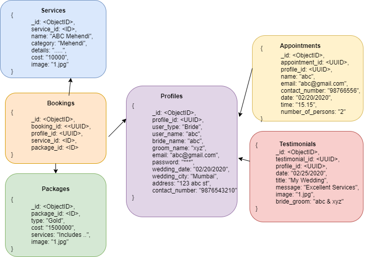
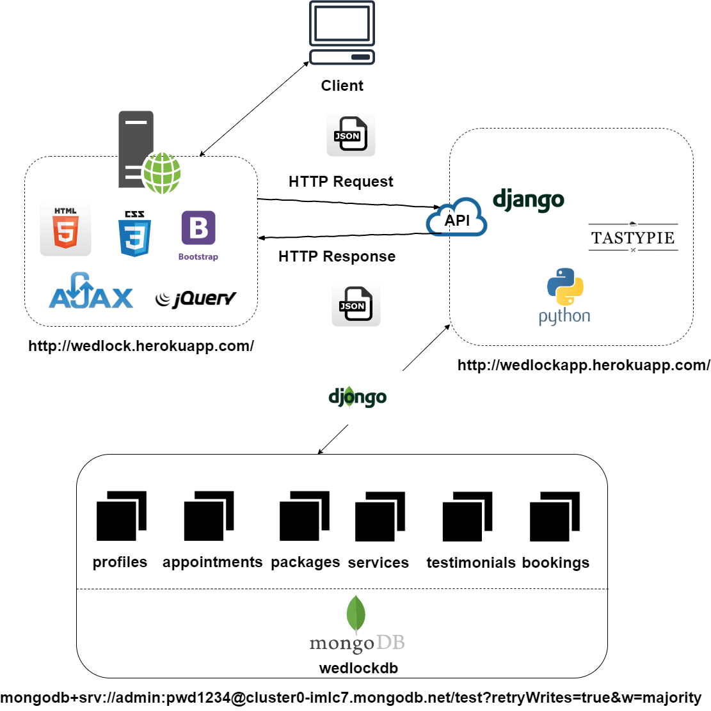

# WedLock
This is a full-stack web application to provide wedding services to the user. It focuses on the concept of emotional web design, responsive web design and mobile first design.
- User accounts: User can sign up and then login to view the dashboard, bookings, and appointments. Users can also browse our curated list of venues and vendors in every category imaginable - designers, photographers, oral decorators, bartenders, caterers, best stylists, and DJs.
- Appointments: WedLock would allow users to schedule an appointment online.
- Wedding packages: Users can also select a wedding package offered by our company. Moreover, users can customize and tailor a package as per their budget and likings.
- User testimonials: Users can view all the posted testimonials by the customers who have availed the WedLock services. Users may also post a testimonial based on their experience.

## Tools Used
- MongoDB Compass
- Visual Studio 2017
- Postman
- Git Bash
- Heroku server

## Technologies used
- HTML5
- CSS3
- AJAX & jQuery
- Django Tastypie Framework

## Non-relational schema

## System Architecture

## Home Page
